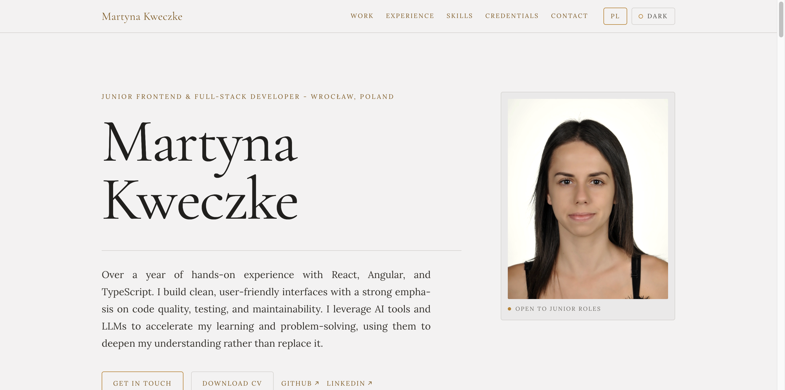

# Martyna Kweczke — Portfolio

My personal portfolio site. I'm a Junior Frontend and Full-Stack Developer based in Wrocław, Poland.

**Live site: [martynakweczke.dev](https://www.martynakweczke.dev)**

<a href="https://www.martynakweczke.dev">
  <picture>
    <source media="(prefers-color-scheme: dark)" srcset="docs/screenshot-dark.png">
    
  </picture>
</a>

## Features

- **Bilingual:** English and Polish, switchable from the header
- **Light and dark theme:** follows the system setting by default and remembers your choice
- **Responsive:** laptop, tablet and phone layouts
- **SEO-ready:** Open Graph and Twitter cards, a canonical URL and JSON-LD `Person` data
- **Accessible:** semantic sections, labelled controls and screen-reader hints for links that open in a new tab or download a file
- **Static export:** built with `output: "export"`, so the site deploys as plain static files

## Sections

Hero · Now · Selected work · Experience · Skills · Credentials · Personal · Contact

## Tech stack

- [Next.js 16](https://nextjs.org) (App Router)
- [React 19](https://react.dev)
- [TypeScript](https://www.typescriptlang.org)
- [Tailwind CSS 4](https://tailwindcss.com)
- Fonts: Cormorant Garamond and Lora through `next/font`

## Getting started

```bash
npm install
npm run dev
```

Then open [http://localhost:3000](http://localhost:3000).

| Script          | What it does                                     |
| --------------- | ------------------------------------------------ |
| `npm run dev`   | Starts the development server                    |
| `npm run build` | Builds the static site into `out/`               |
| `npm run lint`  | Runs ESLint                                      |

## Project structure

```
app/          layout, metadata and the home page
components/   page sections, header, theme and language toggles
lib/          content (EN/PL), theme and language stores
public/       CV, profile picture, project images, OG image
docs/         README screenshots
```

All the text on the site lives in [`lib/content.ts`](lib/content.ts), with separate `en` and `pl` objects.

## Contact

- Email: [martynakweczke@gmail.com](mailto:martynakweczke@gmail.com)
- LinkedIn: [martyna-kweczke](https://www.linkedin.com/in/martyna-kweczke)
- GitHub: [@martynakweczke](https://github.com/martynakweczke)
